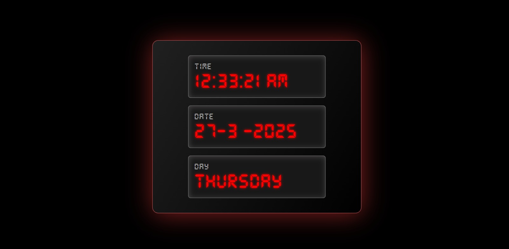

# ⏰ Digital Clock - Live Date and Time Display  
  

A **JavaScript-powered Real-Time Digital Clock** that dynamically updates every second. This project is designed for **web developers, beginners, and UI enthusiasts** who want to explore **JavaScript's Date API, DOM manipulation, and dynamic time rendering**.  

📌 **Live Demo:** 👉 [View Here](https://ashutoshbhole1.github.io/Digital-Clock/)  

---

## 📌 Features
✅ **Real-Time Clock:** Updates every second using `setInterval()`.  
✅ **Formatted Date Display:** Shows the date in `DD/MM/YYYY` format for better readability.  
✅ **Weekday Display:** Dynamically updates the full day name (e.g., Monday, Tuesday).  
✅ **Optimized for Performance:** Lightweight, with minimal resource usage.  
✅ **Simple & Elegant UI:** Designed for easy integration into any webpage.  
✅ **Cross-Browser Compatible:** Works smoothly on **Chrome, Firefox, Edge, and Safari**.  

---

## 🎯 Why Use This Digital Clock?  
This project is perfect for:  
🔹 **Beginners** learning **JavaScript and DOM manipulation**.  
🔹 **Developers** looking for a simple **real-time clock implementation**.  
🔹 **Web designers** needing a dynamic **date & time widget** for websites.  
🔹 **UI/UX enthusiasts** who want to build interactive components.  

---

## 🚀 Live Demo  
🌐 **Check out the Live Digital Clock:**  
👉 [Click Here](https://ashutoshbhole1.github.io/Digital-Clock/)  

---

## 🛠️ Installation & Usage

### **1️⃣ Clone the Repository**
```bash
git clone https://github.com/ashutoshbhole1/Digital-Clock.git
cd Digital-Clock
```
### **2️⃣ Embed in Your Website**
```bash
<iframe src="https://ashutoshbhole1.github.io/Digital-Clock/" width="300" height="100" frameborder="0"></iframe>

```